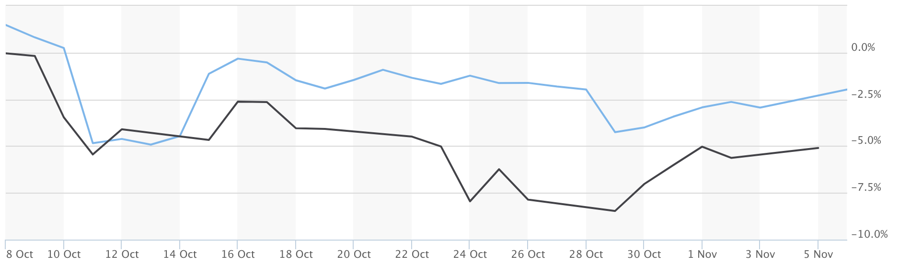

The crypto markets have been pretty boring to watch as of late. They've been surprisingly... stable? In fact, here's a graph of bitcoin vs. the S&P 500 over the last month with bitcoin in blue and the S&P in black.

So, I thought I'd keep myself active by writing down my personal history with crypto. Here it is.

My first encounter with cryptocurrencies was back in 2013. My older brother spent much of his free time browsing through the internet and somehow found out about bitcoin on an internet forum. In the following months, all he could talk about to my parents and I was about bitcoin; how it was going to change the world and more importantly, make him rich. To me, a lot of what he was saying went through one ear and out the other. I was 17, didn’t have any money to invest, and had more important things like college applications to focus on instead. Soon after, my brother’s euphoria with bitcoin came to an abrupt end when he found out most of his bitcoin were stolen from his cryptocurrency wallet – a day that will forever live in infamy to my brother.

Fast forward to 2015. Like my brother, I found myself spending a lot of free time reading tech blogs and hanging out in internet forums. bitcoin was a term that kept popping up. No one seemed to understand what it was or how it worked, but most people (like my brother) said it’s the next big thing and it’ll make you rich. Like any typical college student trying to get rich quick, a couple of friends and I pooled in $100 to buy some bitcoin. I still remember meeting a sketchy looking guy at a Starbucks. My friends and I handed him an envelope containing $100 and he sent us about .25 BTC in return to our cryptocurrency wallet. Unfortunately, like my brother’s bitcoin, these were lost shortly after at a bitcoin-based casino.

I started to get serious with cryptocurrencies during the summer of 2017. With a little more money in my pocket, I decided to spend a lot of time researching them. Now, there were a lot more coins out there, including Ethereum, which I became very interested in. As the year progressed, I backed my investments with research on more coins as I continued to dig deeper down the cryptocurrency rabbit hole. I learned about not only how blockchains work, but also about economics, game theory, governance, philosophy & psychology. The crypto space moved so quickly – I was eager to wake up the next day and read up on all what I missed. Around school, I had built up my name as “the crypto guy.” When prices started increasing towards the end of last year, many friends, friends of friends, and even strangers asked me what they should do. 

My response is still the same. I know a decent amount, but I would consider it miniscule in the grand scale of all there is to know about cryptocurrencies. I have no idea if they’ll go up in a couple of months, or where bitcoin will be next year. However, what I do know, is that they are a fascinating concept and well worth researching.

