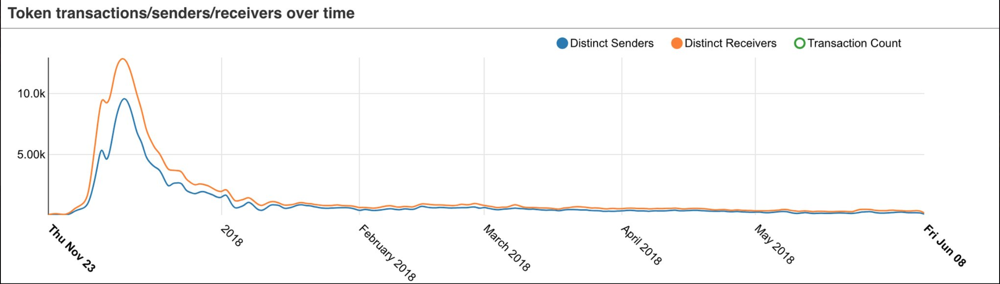

The most common use case for NFTs thus far has been integrating them into blockchain-based games like CryptoKitties. However, I think we've all seen this chart showing Cryptokitties usage is down 98.5% since its peak.

So are NFT based platforms dead already?

I believe NFTs are following the same market as their ancestors (BTC & ETH). Right now, we're in a bear market for cryptocurrencies. Back in December when prices were hot, NFTs like CryptoKitties were a hot buy. Cryptos are down now and similarly, NFT based dapps aren't getting much usage. 

What I think we'll see is something similar to the last bull market. The next one we enter is going to bring in a whole new wave of investors. These investors would just be hearing about CryptoKitties and other NFT based platforms and are going to buy into the hype.

Because just like normal cryptocurrencies, <b> NFTs don't have much use right now other than for speculating on their value. </b> Cryptokitties made a move in the right direction by adding game elements. But I don't think it's a very fun game considering the cost for buying & breeding cats.

I believe most people actively playing Cryptokitties are seeing each cat they buy/breed as an investment. Similarly, most people who buy/mine cryptocurrencies see them as an investment also. This is not necessarily a bad thing, but I think we can do a lot better.

#### Thoughts & questions regarding NFTs:

* Stop cloning centralized games and putting them on the blockchain.
    * I'm hesitant about games like <a href="http://godsunchained.com/" target="_blank">this</a>. Blizzard games do so well over time because they continuously incorporate balance changes. Does this work well on a blockchain where things are supposed to be immutable?
* Reduce the barrier for entry
    * People shouldn't have to spend a lot of money to get started.
* Does every NFT have to be seen as an investment?
    * Currently, all NFTs are priced in ETH or another token that has value. People might not want to buy an NFT because it might depreciate in price. In-app currencies like V-bucks are fun to accrue and spend because we know outside of the game the currency has no value.
* Do people _really_ care about true ownership? Is this going to be the big selling point for NFTs?
    * Users might feel more comfortable with someone else holding their items.

#### Conclusion

I think we need to steer away from having NFTs be just another asset class to invest in. Rather, we need to build NFT based platforms so holders are incentivized to really utilize NFTs. Tony Sheng does a good job explaining this and writes about it [here](https://www.tonysheng.com/dont-design-speculators). His summary: Don't design for speculators.

We shouldn't forget that the tech is less than a year old and the possibilites surely are exciting. There's a lot of work to be done to improve it so please reach out if you're looking for help! 